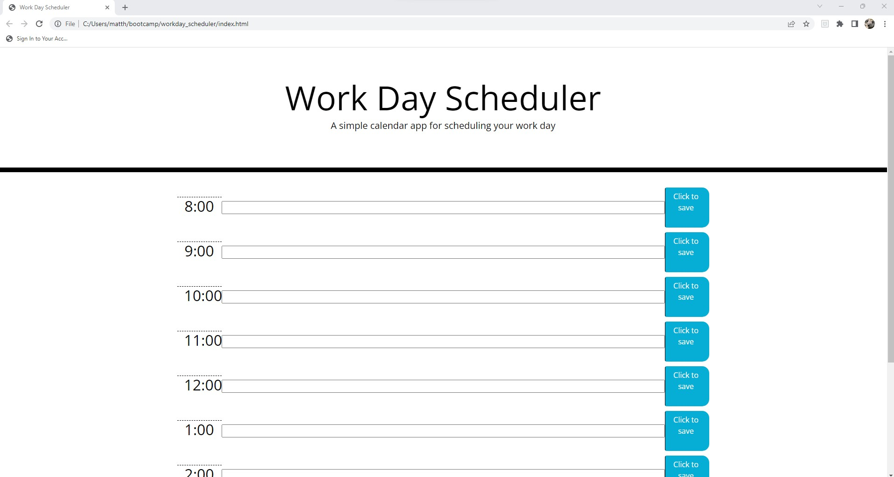

# workday_scheduler

## Description

This scheduler uses javascript to save text for your workday.  it still needs moment.js and I'm currently working on getting my local storage to work. 

## Usage

website: https://matth747.github.io/workday_scheduler/

github: https://github.com/matth747/workday_scheduler

